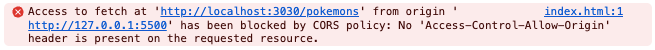
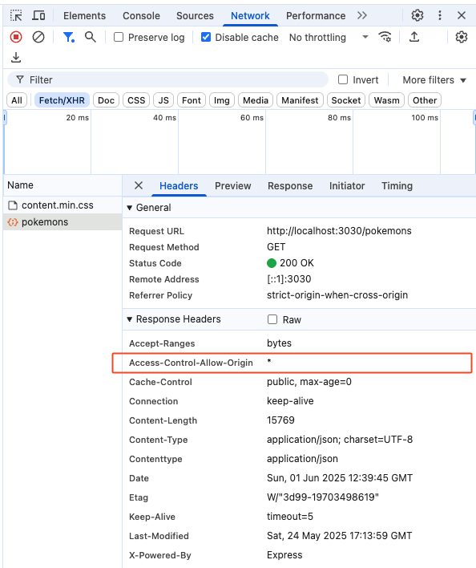

# CORS (Cross-Origin Resource Sharing)

## What is CORS?

<< overview generated by GitHub Copilot >>

CORS (Cross-Origin Resource Sharing) is a security feature implemented by web browsers to control how resources are shared between different origins. An "origin" is defined by the combination of a protocol (e.g., `http` or `https`), domain, and port. For example, `http://example.com` and `https://example.com` are considered different origins.

By default, browsers restrict cross-origin requests for security reasons. This means that if a web application running on `http://example.com` tries to fetch data from `http://api.example.com`, the browser will block the request unless the server explicitly allows it.

CORS works by adding special HTTP headers to the server's response. These headers specify which origins are allowed to access the server's resources. For example:

```http
Access-Control-Allow-Origin: http://example.com
```

This header tells the browser that `http://example.com` is allowed to make requests to the server.

Key concepts in CORS:

- **Preflight Requests**: For certain types of requests (e.g., `POST` with custom headers), the browser sends a preliminary `OPTIONS` request to check if the server allows the actual request.
- **Access-Control-Allow-Headers**: Specifies which headers can be used in the request.
- **Access-Control-Allow-Methods**: Specifies which HTTP methods (e.g., `GET`, `POST`) are allowed.

CORS is essential for enabling secure communication between web applications and APIs hosted on different domains.

⚠️ **Important:** You cannot control CORS from the client side. It is a server-side configuration that must be set by the API provider. If you find that the API that you are considering for your project gives you CORS-related errors, it is best to find an alternative API that does supports CORS.

## CORS Demo

Folder: `6-cors`

The demo consists of both a client and a server. The server is a simple Node.js application that serves static files and handles CORS requests. The client is a basic HTML page that makes requests to the server.

### Server Setup

1. Navigate to the `server` folder.
2. Run `npm install` to install the necessary dependencies.
3. Start the server with `npm start`. The server will run on `http://localhost:3030`.

### Client Instructions (cross-origin request)

1. Open the `index.html` file from the `client` folder in your web browser.
2. The page will display a button to fetch data from the server.
3. Click the button to make a request to the server.

The message "Failed to fetch" will be displayed on the page, and you should see an error message in the console indicating that the request was blocked by CORS policy:



This is expected because the server does not allow requests from the origin of the client, because the client is running on a different port than the server (`nnnn` in the URL below depends on how you run the client, e.g. by right-clicking on the `index.html` file and selecting **Open with Live Server** it normally opens it on port 5500).

| Client Origin | Server Origin |
|---------------|---------------|
| `http://localhost:nnnn` | `http://localhost:3030` |

### Client Instructions (same-origin request)

1. Type the following URL in your browser's address bar: `http://localhost:3030`.
2. Click the button to make a request to the server.

The page will display the fetched data as raw JSON, and you will not see any CORS-related errors in the console. This is because the client and server are running on the same origin (same protocol, domain, and port):

| Client Origin | Server Origin |
|---------------|---------------|
| `http://localhost:3030` | `http://localhost:3030` |

### Allowing CORS

To allow CORS, you need to modify the server code to include the appropriate headers. Open the `server.js` file, uncomments the following code and save the file (the server will automatically restart):

```javascript
// app.use((req, res, next) => {
//   res.setHeader('Access-Control-Allow-Origin', '*');
//   next();
// });
```

This allows **all** origins to access the server's resources. You can also specify a specific origin instead of using `*` for more security.

Try the HTML file in the `client` folder again by right-clicking on the `index.html` file and selecting **Open with Live Server**.

Now, when you click the button in the client, the request should succeed, and you will see the fetched data displayed on the page as raw JSON.

If you open the Developer Tools (F12) and select the Network tab as shown in the screenshot below you can that the server response included a response header `Access-Control-Allow-Origin: *`, giving permission to the client to access the server's resources, even though they are on different origins.

!